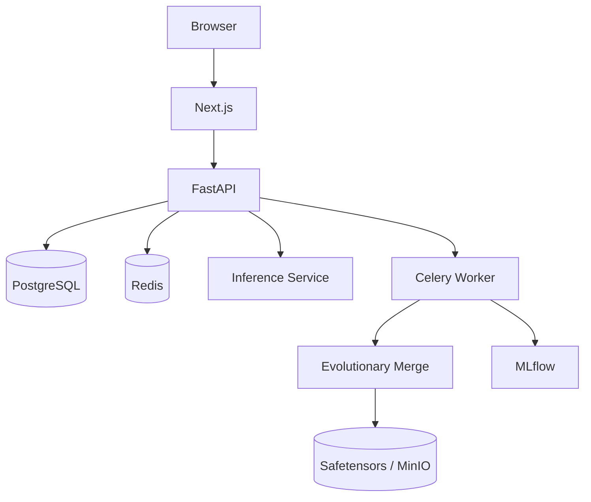
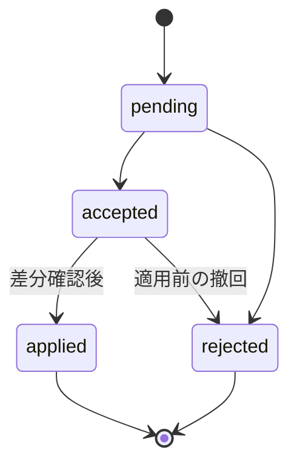

# Architecture

## コンポーネント

APIは業務データの唯一の書き込み境界です。推論サービスは承認済み成果物を読み取るだけで、業務テーブルを更新しません。モデルマージはオンライン推論から分離したCeleryジョブです。

## テナント境界

認証されたユーザーに対し、`X-Organization-ID`と`OrganizationMember`を照合します。その後の全業務クエリに`organization_id`条件を適用します。クライアントが送信したリソースIDだけを使った検索は禁止します。

## AI提案状態

提案生成、判断、実変更は別の操作です。実変更時にはユーザー権限と現在のタスク状態を再確認し、監査ログを同一トランザクションで保存します。

